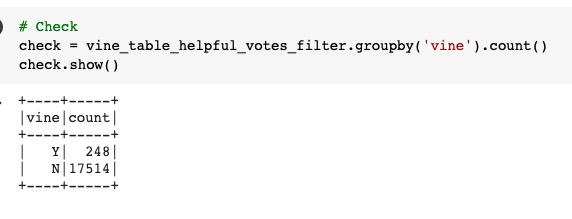
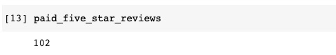
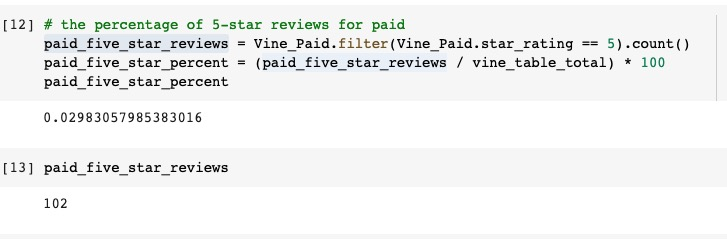
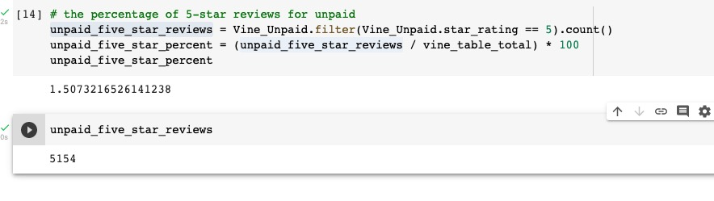
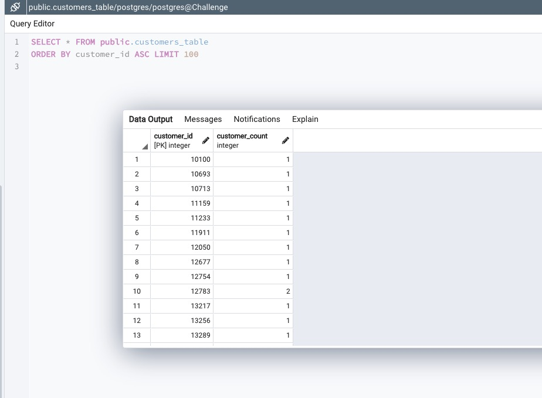
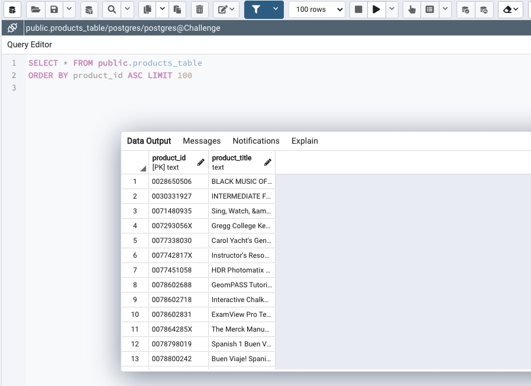
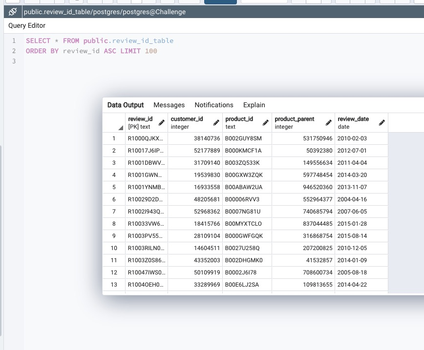
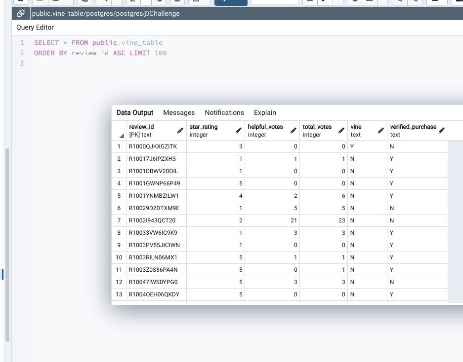

# Amazon_Vine_Analysis

## Overview of the Analysis
- This project is designed to use PySpark to perform the ETL process to extract the dataset, transform the data, connect to an AWS RDS instance, and load the transformed data into pgAdmin. Next, you’ll use PySpark, Pandas, or SQL to determine if there is any bias toward favorable reviews from Vine members in your dataset. 

## Results
- How many Vine reviews and non-Vine reviews were there?

- Vine Reviews: 248
- Non-Vine Reviews: 17514

- How many Vine reviews were 5 stars? How many non-Vine reviews were 5 stars?

- View Reviews with 5 stars: 102
- Non-Vine Reviews with 5 stars: 5154

- What percentage of Vine reviews were 5 stars? What percentage of non-Vine reviews were 5 stars?

- % of View Reviews with 5 stars: 0.0298%
- % of Non-Vine Reviews with 5 stars: 1.5073%

### Other Results

## Summary
- There is not strong bias toward five-star reviews from paid Amazon Vine reviewers from the data. For additional analysis, we could look at the distribution of all star-levels across paid and unpaid reviews. 